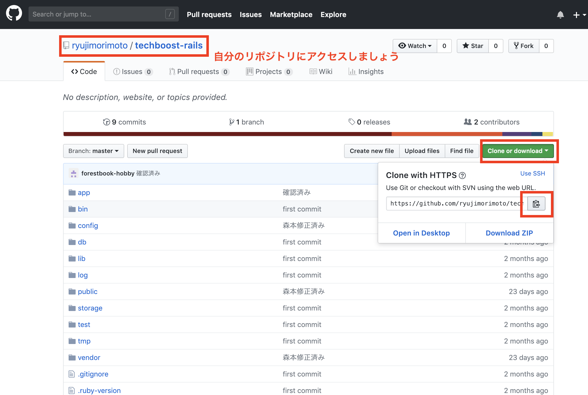

# Railsの環境構築

## 本章の目的：


- すでに作成してあるRailsプロジェクトと GitHub からpullしてくる方法をやってみます。
- おそらく初めのRailsアプリはDBの設定が Sqltite3 になっているので、DBを変更する設定もやってみます。


***

### 本章では、前章で構築したRailsの環境に自分で作成した、Railaアプリケーションをデプロイします。

デプロイというのは、アプリケーションが、ネットワーク上で利用できるようにすることを指します。  

サーバー上で、ソースが正しいだけでなく、いろんな環境がキチンと動いていないといけない。  

環境を含めて、利用できるようにすることをデプロイといいます。  

#### GitHubからpullしてくる

自分のソースを上げているGitHubからpullしてきましょう。
ここでは、tech-boostのrailsアプリをpullして見ます。
各自のリポジトリの場所により、アドレスは変更になります。
各自読み替えてください。


<hr>
<br />
<br />

```
$ git clone https://github.com/[自分のリポジトリ].git
```


## bundler を利用したgemの一括インストール


####もしherokuでデプロイしている方は,gem pgを入れている方、DBにポストグレスを利用している方
はこれから編集します。

config>database.yml
を編集します。cdで移動して

```
default: &default
  adapter: mysql2
  encoding: utf8
  pool: <%= ENV.fetch("RAILS_MAX_THREADS") { 5 } %>
  username: <%= ENV.fetch("DBUSER_NAME") %>  //環境変数からDBの名前を取得します
  password: <%= ENV.fetch("DBUSER_PASSWORD") %>　　//環境変数からパスワードを取得します。
  socket: /var/lib/mysql/mysql.sock  //17章で探したソケットの場所を記入します。
```


```
$ bundle exec install

//===
rbenv: version `2.4.1' is not installed (set by /home/ec2-user/rails_app/techboost-rails/.ruby-version)
```
あれれどうしたことでしょう？
どうやらこのプロジェクトではrubyの2.4.1を利用しているみたいですね。

念の為Gemfileを見てみます。

```
$ more Gemfile


//===
ruby '2.4.1'

# Bundle edge Rails instead: gem 'rails', github: 'rails/rails'
gem 'rails', '~> 5.2.1'
```

rubyの2.4.1とrailsの5.2.1を利用しているようです。

####ruby 2.4.1をインストールします。
rbenvを入れているので簡単です。
インストールできる一覧を表示

```
$ rbenv install --list

```

#### 2.4.1がありましたのでインストールします。
```
$ rbenv install -v 2.4.1
```

#### 再読込
これはパッケージ等をインストールした際に、ハッシュテーブルからコマンドをよびだしているので、パスを通して,
いるのに、見つからない場合があります。

なので保険のためにコマンドをうちます。

```
$ rbenv rehash
```

#### rbenvのバージョンを確認

```
$ rbenv versions

//===
* 2.4.1 (set by /home/ec2-user/rails_app/techboost-rails/.ruby-version)
  2.5.3
```

前章では2.5.3をグローバルにしましたね。
このフォルダの中では2.4.1が使われているということです。
#### デプロイするので2.4.1　をグローバルにしましょう!

```
$ rbenv global 2.4.1


//===
* 2.4.1 (set by /home/ec2-user/rails_app/techboost-rails/.ruby-version)
  2.5.3
```

#### bundlerのインストール

```
$ gem install bundler
```

#### bundlerを利用してgemをインストールします

```
$ bundle install

//===
エラー
An error occurred while installing pg (1.1.3), and Bundler cannot continue.
Make sure that `gem install pg -v '1.1.3' --source 'https://rubygems.org/'` succeeds
before bundling.
```

これは gem pg がないと言っています。
DBを postgres に設定しているみたいですね。
今回は MySQLを利用しますので設定を変更します。

#### DB変更する際の作業フロー
- gemファイルを追加　=>postgres からmySQLへ接続するgemの変更
- database.yml ファイルの変更 => railsが利用するDBの設定ファイル
- DBの作成　=> 新しいDBなのでまずアプリ用のDBを作成しないといけません。
- マイグレーションファイルの実行	=> 作成したDBの中に、テーブルやカラムを追加していきます。

#### まずGemfileを見てみましょう

```
$ less Gemfile

```
lessというのはファイルの中身を表示します。
スクロールもします。
q ボタンを入力するまで閉じません。
便利です。


ではgemファイルの変更をしていきましょう。
```
$ vi Gemfile
```

いろんなgemが表示されています

```
# Use mysql as the database for Active Record
gem 'mysql2', '>= 0.4.4', '< 0.6.0', group: :development


group :production do
  gem 'pg', '>= 1.1.3'
end

```
ここですね。プロダクション環境（デプロイ環境の事）
ではgemにpg つまりpostgresへの接続を利用していました。
:development環境では,mysql2 つまりMySQLを利用していました。
これを変更します。

i ボタンでinsert つまり追加、編集できるようになります。
その上で
```
group :production do
  gem 'mysql2', '>= 0.4.4', '< 0.6.0'
end
```

このように上記のgemをそのままコピーします。
ない方は、本家のサイトで確認ください。

画面内で ESC  キーを押すと編集完了になります。
そして : セミコロンを押すとカーソルが一番左下に来ます
そして wq 
とリターンキーで保存完了です。
wqは write quite  書き込んで、終了の意味です。
こんなイメージです。

```
gem 'tzinfo-data', platforms: [:mingw, :mswin, :x64_mingw, :jruby]
gem 'jqugem 'mysql2', '>= 0.4.4', '< 0.6.0'ery-rails', '~> 4.3', '>= 4.3.3'
gem 'jquery-ui-rails'
gem 'bootstrap-sass'
//ここになります。
:wq
```

終わったら、変更されているか、再度lessコマンドで確認しておきましょう。

####database.yml ファイルの変更
config フォルダ内にあります
移動して同じように

```
$ vi database.yml


//==このように変更します。
default: &default
  adapter: mysql2
  encoding: utf8
  pool: <%= ENV.fetch("RAILS_MAX_THREADS") { 5 } %>
  username: <%= ENV.fetch("DBUSER_NAME") %>
  password: <%= ENV.fetch("DBUSER_PASSWORD") %>
  socket: /var/lib/mysql/mysql.sock
```

?????????ここから2019.1.22

このproductionを書き換えていきます。
databaseの名前
databaseのuser名
パスワードが必要なことがわかりますね。

作成したMySQLのユーザーパスワードを確認しましょう。

####MySQLの確認


```
mysql57.x86_64                       5.7.24-1.10.amzn1             amzn-updates 
mysql57-common.i686                  5.7.24-1.10.amzn1             amzn-updates 
mysql57-common.x86_64                5.7.24-1.10.amzn1             amzn-updates 
mysql57-devel.x86_64                 5.7.24-1.10.amzn1             amzn-updates 
mysql57-embedded.x86_64              5.7.24-1.10.amzn1             amzn-updates 
mysql57-embedded-devel.x86_64        5.7.24-1.10.amzn1             amzn-updates 
mysql57-errmsg.x86_64                5.7.24-1.10.amzn1             amzn-updates 
mysql57-libs.i686                    5.7.24-1.10.amzn1             amzn-updates 
mysql57-libs.x86_64                  5.7.24-1.10.amzn1             amzn-updates 
mysql57-server.x86_64                5.7.24-1.10.amzn1             amzn-updates 
mysql57-test.x86_64 
```

これで大丈夫だと思います。

```
$ yum list installed | grep mysql

//--
mysql-config.x86_64             5.5.62-1.23.amzn1                  @amzn-updates
mysql57.x86_64                  5.7.24-1.10.amzn1                  @amzn-updates
mysql57-common.x86_64           5.7.24-1.10.amzn1                  @amzn-updates
mysql57-devel.x86_64            5.7.24-1.10.amzn1                  @amzn-updates
mysql57-errmsg.x86_64           5.7.24-1.10.amzn1                  @amzn-updates
mysql57-libs.x86_64             5.7.24-1.10.amzn1                  @amzn-updates
mysql57-server.x86_64           5.7.24-1.10.amzn1 
```


```
sudo yum install mysql57-devel.x86_64

//===
mysql  Ver 14.14 Distrib 5.7.24, for Linux (x86_64) using  EditLine wrapper

```
5.7がインストールされています。
毎回起動しなくていいように、サーバーを起動するとmySQLも起動するように設定します。

```
$ sudo chkconfig mysqld on

```


==================いらないかも
####MySQLの確認にログインする

MySQLの確認にログインする,ログインパスワードを設定します。
今回はpassword という名前にしていますが、推測しにくい名前に各自してくだだい。

```
$ mysqladmin -u root password 'password'
```

ログインします。パスワードは各自のものを利用ください
```
[ec2-user@ip-10-0-12-153 rails_app]$ mysql -u root -p
Enter password: 

Type 'help;' or '\h' for help. Type '\c' to clear the current input statement.

mysql> 
```


myqlのソケットが違うと言われたので、どこにあるか探してみましょう。

```
$ sudo find / -name mysql.sock | grep mysql.sock 
/var/lib/mysql/mysql.sock
```
ここにあったので変更しましょう

railsの環境をサーバーに教えてあげましょう

```
export RAILS_ENV=production
export EDITOR="vi"
```


mysql> のように表示されるとmysqlにログインできています。
抜けるときは
####exit;
と打ちます。

####railsのユーザーを作成します

```
create user rails_user@localhost identified by 'rails_user_password';
```

コマンド入力のときにセミコロンが無いと ->　と出ますが慌てずに；　セミコロンだけ打ってください。
sql文は何行に渡っても記載できるからです。

特定のDBだけにアクセスできる権限を与えます。

GRANT ALL ON testdatabase.* TO testuser@'%' IDENTIFIED BY 'password';

=======ここまでいらないかも===========


database.ymlファイルを変更します。

```
production:
  adapter: postgresql
  encoding: unicode
  pool: 5
  # database: pictgram_production
  # username: pictgram
  # password: <%= ENV['PICTGRAM_DATABASE_PASSWORD'] %>

```

このように書き換えます。
```
default: &default
  adapter: mysql2
  encoding: utf8
  pool: <%= ENV.fetch("RAILS_MAX_THREADS") { 5 } %>

//==省略

production:
  adapter: mysql2
  encoding: utf8
  pool: 5
  username: root
  password: 'password' => 先程設定したパスワードを入力します。
  socket: /tmp/mysql.sock
  host: localhost
```
抜けるときは,[ESCキー]　+ [:] + [wq] 
でしたね。

####RailsでDBを作ります

```
$ rails db:create RAILS_ENV=production
???????ここまで

credentials.yml.enc
のファイルを設定しましょう。


//==
Can't connect to local MySQL server through socket '/tmp/mysql.sock' (2)
Couldn't create database for {"adapter"=>"mysql2", "encoding"=>"utf8"
```
ソケットファイルが無いと言われてしまいました。
作ります

```
$ touch /tmp/mysql.sock

//再起動します
$ sudo service mysqld restart


//==
Stopping mysqld:                                           [  OK  ]
Starting mysqld:                                           [  OK  ]
```


Mysql2::Error::ConnectionError: Can't connect to local MySQL server through socket '/tmp/mysql.sock' (111)

今度はserverがつながらないと

それぞれのソケットファイルを合わせます。
/etc/my.cnf を下記の様に書き換えましょう

```
[mysqld]
datadir=/var/lib/mysql
socket=/var/lib/mysql/mysql.sock
省略
```

このように変更しました
```
[mysqld]
datadir=/var/lib/mysql
socket=/tmp/mysql.sock
[client]
socket=/tmp/mysql.sock
```


???????このエラーでとまっている　
mysql サーバーとつながっていない？
Mysql2::Error::ConnectionError: Can't connect to local MySQL server through socket '/var/lib/mysql/mysql.sock' (2)


